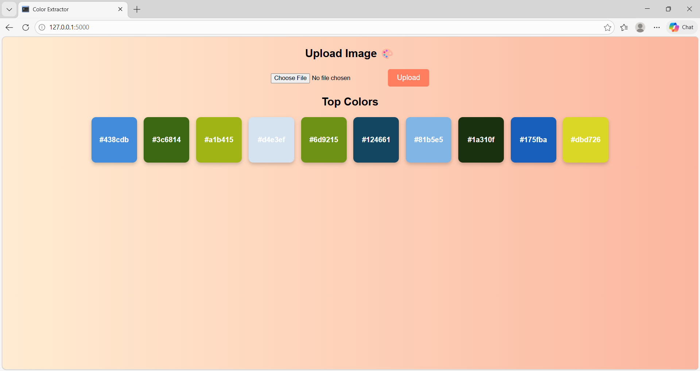

# 🎨 Color Palette Extractor

A simple web application that allows users to upload an image and extract the top 10 most dominant colors along with their HEX codes.

---

## 🚀 Features

- Upload any image  
- Extract top 10 dominant colors  
- Display colors with HEX values  
- Clean and colorful UI  

---

## 🛠️ Built With

- Python  
- Flask  
- NumPy  
- Scikit-learn  
- Pillow  
- HTML & CSS  

---

## 📸 Preview



---

## ⚙️ Installation

1. Clone the repository:
```bash
git clone https://github.com/your-username/color-palette-extractor.git
```

2. Navigate to the project folder:
```bash
cd color-palette-extractor
```

3. Install dependencies:
```bash
pip install -r requirements.txt
```

4. Run the app:
```bash
python main.py
```

5. Open in browser:
```
http://127.0.0.1:5000/
```

---

## 💡 How It Works

- The user uploads an image  
- The image is processed using NumPy  
- K-Means clustering (Scikit-learn) finds dominant colors  
- Colors are converted to HEX and displayed  


## 👩‍💻 Author

- Your Name
